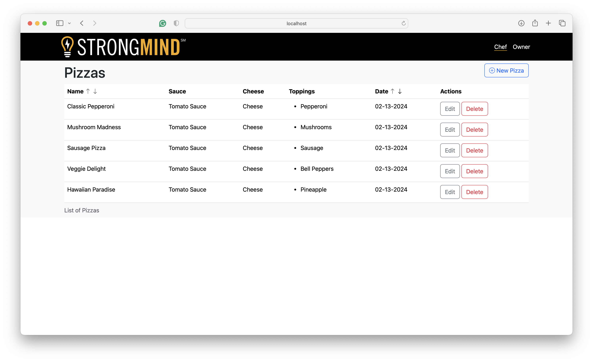
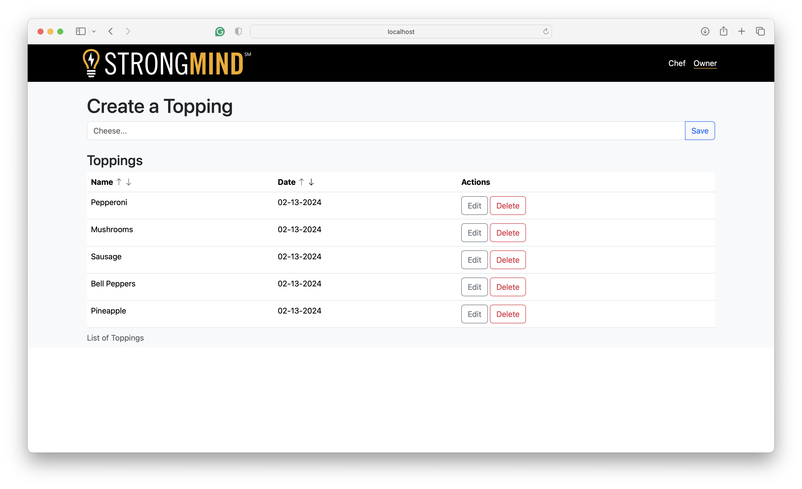

# StrongMind Pizza

Welcome to StrongMind Pizza! This is a web application for managing pizza orders and toppings.

## Features

- **Pizza Management**: Create, update, and delete pizza recipes.
- **Topping Management**: Create, update, and delete pizza toppings.

## Running Locally

1. Clone the repository to your local machine:
```bash
git clone https://github.com/MrLuna12/pizza-app.git
```

2. Navigate to the project directory
```bash
cd pizza
```
3. Install dependencies using composer
```bash
composer install
```
4. Configure environment variables by copying the .env.example file to .env:
```bash
cp .env.example .env
```
5. Set up your database credentials in the .env file.
```env
DB_CONNECTION=mysql
DB_HOST=127.0.0.1
DB_PORT=3306
DB_DATABASE=pizza
DB_USERNAME=<username>
DB_PASSWORD=<password>
```
6. Generate the APP_KEY in the .env file
```bash
php artisan key:generate
```  
7. Ensure Database Existence: Log into MySQL & Create a MySQL database named 'pizza'
```bash
mysql -u USERNAME -pPASSWORD
CREATE DATABASE pizza;
```
8. Go to project directory and Migrate the database and seed it with some data
```bash
php artisan migrate --seed
```
9. Serve the application:
```bash
php artisan serve
```
10. Access the application in your web browser:
```bash
http://localhost:8000
```
## Running Tests
1. In the root directory, run:
```bash
php artisan test
```
2. Re-seed the database after the tests to repopulate the DB
```bash
php artisan db:seed
```
## File Structure:
- **app/Models/**: Here you will find the models
- **app/Livewrie/**: Here you will find the Livewire components that act like controllers
- **app/database/**: Here you will find the Factory (used to create fake data), DB Migration, DB Seeder
- **app/public/**: Here you will find the CSS and images that I used for the app
- **app/resources/views**: Here, you will find my views for the app.
- **app/routes/web.php**: Here you will find the routes I created for the app
- **app/test/Feature**: This directory contains all the test implementations

## Images:




